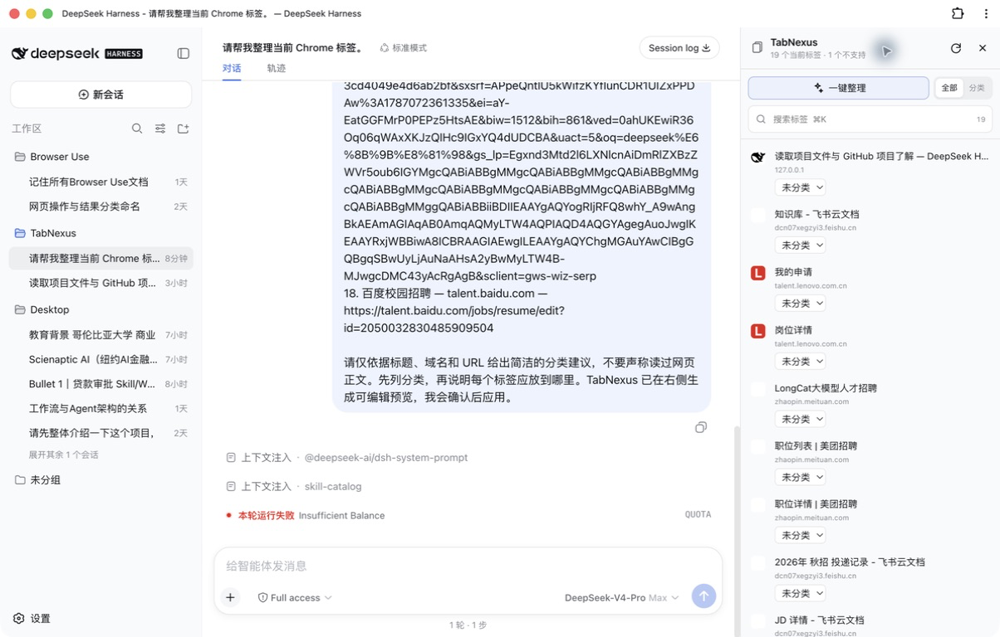

# TabNexus for DSH

> Manage the current Chrome window without leaving DeepSeek Harness.

[中文](README.md) · [Install](docs/INSTALL.md) · [Compatibility](docs/COMPATIBILITY.md) · [Architecture](docs/ARCHITECTURE.md)

TabNexus-DSH v0.4 is a Chrome-first tab manager embedded in DSH:

**sync on open → flat live tab list → one-click organization → editable preview → confirm**



## Highlights

- A small TabNexus icon in the DSH top-right area replaces the old floating pill.
- The native DSH details column keeps the sidebar close to the default left width and resizes the conversation instead of covering it.
- The panel reads the current Chrome window immediately and refreshes while open.
- Tabs show favicon, title, domain, pinned and active states; clicking focuses the existing Chrome tab.
- One-click organization accepts free-form instructions and creates an editable preview before applying.
- A live DSH session can review the proposed organization through the existing composer.
- Manual categories, search, and flat/grouped views remain available.
- The flow view has been removed.

## No duplicate Agent stack

DSH already is the Agent. The plugin does not register MCP/Agent tools, does not call a separate model API, and needs no API key. Its Host code only proxies the existing loopback Chrome bridge to the same-origin panel. Chrome remains the source of truth; only category preferences are stored in Client `localStorage`.

## Install

Install the TabNexus Chrome extension and enable its local bridge, then:

```bash
curl -LO https://github.com/KaichenCurry/TabNexus-DSH/releases/download/v0.4.2/dsh-plugin-tabnexus-0.4.2.tgz
dsh plugin --profile web add ./dsh-plugin-tabnexus-0.4.2.tgz
```

Restart DSH and refresh `http://127.0.0.1:3080/`. The desktop shell uses the same Client bundle.

## Safety

- v0.4 can read and focus tabs, but cannot bulk-close them.
- Tab titles and URLs are not webpage contents.
- The Chrome bridge is restricted to loopback.
- Organization never silently overwrites categories.

## License

[MIT](LICENSE)
