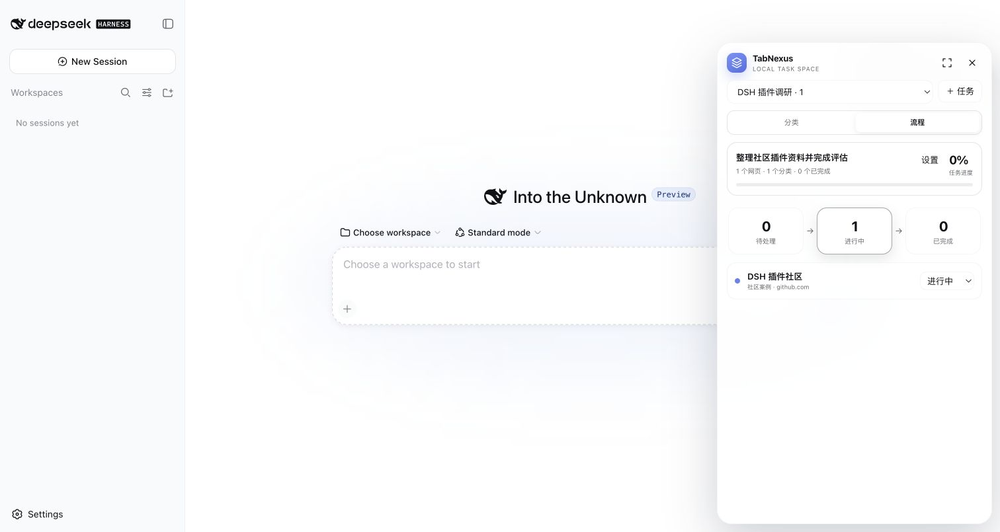

# TabNexus for DSH

TabNexus-DSH is a small, client-only task and webpage organizer for DeepSeek Harness.

**Tasks → categories → webpage status → simple flow**

DeepSeek Harness is already the Agent, so this plugin intentionally registers no Agent tools, MCP server, Host API, or model integration. It works immediately from the top-right `TabNexus` capsule.



## v0.3.0

- Create, switch, rename, and delete tasks; add a task goal.
- Organize webpages into categories and move them at any time.
- Keep a title, URL, note, and Todo / In progress / Done status for every page.
- Switch between a category view and a compact three-stage flow view.
- Official DSH `shell.overlay` integration with a glass Dock, expanded workspace, and narrow-screen drawer.
- Browser-local persistence; no cloud upload and no API key.
- Only `http://` and `https://` URLs are accepted. Tracking parameters are removed before duplicate checks.

## Install

```bash
curl -LO https://github.com/KaichenCurry/TabNexus-DSH/releases/download/v0.3.0/dsh-plugin-tabnexus-0.3.0.tgz
dsh plugin --profile web add ./dsh-plugin-tabnexus-0.3.0.tgz
```

Restart DSH and refresh `http://127.0.0.1:3080/`. The desktop shell uses the same Web Client.

## Boundaries

- No Agent tools, MCP, Host routes, or SSE.
- No live Chrome-tab reading or bulk closing.
- No local files, cloud sync, or Chrome-extension sync.

## License

[MIT](LICENSE)
